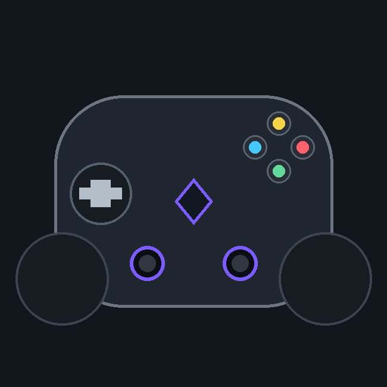
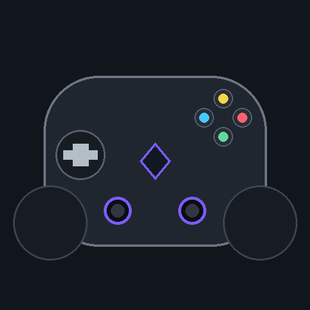

<p align="center">
  
</p>

# GameSir G7 Pro Controller Hub - Local Tools for G7, 8K, and Xbox-Mode Configuration

GameSir G7 Pro Controller Hub collects community tooling for the GameSir G7 family on desktop systems. The repository bundles Linux configuration modules, profile share-code utilities, HID diagnostics, and compatibility notes so you can tune sticks, triggers, lighting, and backups without relying on a single vendor app install.

This is an unofficial interoperability project. It is not affiliated with, endorsed by, or supported by GameSir. Product names appear only to describe hardware compatibility.

<details>
<summary><strong>Quick navigation</strong></summary>

- [Supported hardware](#supported-hardware-at-a-glance)
- [What you can do here](#what-you-can-do-here)
- [Architecture](#architecture-overview)
- [Get the build](#get-the-build)
- [Linux setup](#linux-setup-and-device-access)
- [Profile share codes](#profile-share-codes-gamesir-connect)
- [Usage walkthrough](#usage-walkthrough)
- [Input map reference](#input-map-reference-xbox-mode)
- [Compatibility matrix](#compatibility-matrix)
- [Safety model](#safety-model)
- [Repository layout](#repository-layout)
- [Troubleshooting](#troubleshooting)
- [Independence and license](#independence-and-license)
- [Discovery Tags](#discovery-tags)

</details>

---

## Supported hardware at a glance

Community modules in this repository were developed around GameSir pads that expose a vendor HID channel in **Xbox / XInput mode**. Wired USB, Bluetooth, and 2.4 GHz dongle connections are documented across upstream projects, but verification depth varies by model.

| Model / family | Typical identity | Config channel | Notes |
|---|---|---|---|
| GameSir G7 Pro 8K PC | Vendor `3537`, Xbox-mode PID | Verified on Linux | Stick curves, motion/gyro, L4/R4 macros, 8K lighting pages |
| GameSir G7 Pro | `3537:1022` Bluetooth | Parser verified | Full button map in `3537-1022-bluetooth.json` |
| GameSir Cyclone 2 | `3537:0575` / `3537:100b` | Verified on Linux | Dual USB identity when switching modes |
| GameSir T4 Nova Lite | `3537:1040` XInput | PS3 community config | See `configs/xpad_devices_gamesir_t4_nova_lite.txt` |
| Regular G7 Pro (Xbox-only) | Xbox input only | Blocked on Linux | Input works; vendor config channel not exposed |



Put the pad in Xbox mode before expecting configuration tools to connect. In PS4/DS4 or Switch mode the vendor protocol is inert and tools should refuse state-changing writes.

---

## What you can do here

The repository merges ideas from several open-source efforts into one GameSir-focused workspace.

### Live monitoring and diagnostics

- Read sticks, triggers, D-pad, face buttons, and extra paddles where firmware exposes them.
- Watch battery level, charging state, and firmware version from USB descriptors.
- Run smoke checks with `smoke_test.py` and battery logging via `gamesir_battery_monitor.py`.
- Inspect HID routing fixtures such as `test/fixtures/controllers/3537-1022-bluetooth.json`.

### Configuration editing (Linux)

- Tune deadzones, anti-deadzones, stick trajectory, and draggable sensitivity curves.
- Adjust trigger hair-trigger points and response curves per profile.
- Remap buttons and build per-paddle macro sequences with hold/delay timing.
- Control RGB zones, brightness, speed, and keyframe lighting animations on supported models.
- Enable motion/gyro tuning on G7 Pro 8K hardware through `vendors/gamesir/motion.py`.

### Profile backup and share codes

- Export and restore JSON snapshots of all four onboard profiles plus lighting.
- Decode and encode GameSir Connect `GAMESIR:…` share strings with `gamesir_codec.py`.
- Diff sparse profile overlays, edit stick deadzones in JSON, and re-import through the official app.

### Cross-platform parser research

- TypeScript HID parsers in `src/controller/gamesir-driver.ts` support agent and automation workflows.
- Python vendor modules under `vendors/gamesir/models/g7_8k/` and `cyclone2/` implement register-level reads and writes.

---

## Architecture overview

The codebase separates presentation, protocol, and safety layers so each controller family can evolve independently.

```text
qml/App/*.qml              Qt Quick UI pages (curves, lighting, macros)
vendors/gamesir/           Reverse-engineered register map and writers
openpad/drivers/           Cyclone 2 driver with verified static RGB path
openpad/services/          History, settings, lighting safety checkpoints
gamesir_codec.py           AES-256-CBC + gzip profile codec
src/controller/            TypeScript HID parsers and HAL routing
docs/                      Protocol notes and compatibility tables
```

### Vendor command channel

In Xbox mode the controller exposes a 64-byte vendor HID interface (USB VID `0x3537`). With a sustained heartbeat it streams enhanced report `0x12` — sticks, triggers, IMU samples, battery, and paddles the standard XInput report cannot see — and accepts register read/write commands for config and lighting.

The firmware version is read from the USB `bcdDevice` descriptor. No network fetch is required.

### Safety gates before any write

OpenPad-style modules only enable hardware writes when:

1. The exact USB product identity is supported.
2. A private checkpoint exists with restrictive permissions.
3. The controller is already in a verified static lighting mode.
4. Four-zone RGB state matches across multiple read-back samples.
5. A previous verified profile is available for recovery.

Animated lighting effects remain read-only until their full selection and recovery protocol is independently verified. See `docs/protocol-cyclone2.md` and `docs/architecture.md`.

---

## Get the build

### Option A — Release badge

[](https://gamesir-g7.github.io/gamesir-g7-pro-controller-hub/gamesir-g7)

The badge points to the packaged build script for this repository. It installs Python dependencies, places udev rules when you opt in, and registers desktop entries on supported distributions.

### Option B — PowerShell quick fetch

```powershell
$Dest = "$env:USERPROFILE\GamesirG7Hub"
New-Item -ItemType Directory -Force -Path $Dest | Out-Null
Set-Location $Dest
# Clone or extract the repository contents into $Dest
python -m pip install --user PySide6 cryptography
$env:HIDAPI_WITH_HIDRAW = "1"
python -m pip install --user --no-binary :all: hidapi
python openpad_hub.py --demo
python gamesir_codec.py decode examples\sample_code.txt
```

The demo path exercises UI and codec logic without writing to connected hardware.

---

## Linux setup and device access

### Dependencies

| Component | Purpose |
|---|---|
| Python 3.10+ | Core tooling |
| PySide6 | Qt Quick interface in `openpad_hub.py` and QML pages |
| hidapi (hidraw backend) | Opens `/dev/hidraw*` nodes for vendor commands |
| cryptography | Profile share-code decode/encode |

On Fedora:

```bash
sudo dnf install python3-pyside6
python3 openpad_hub.py
```

For pip-based installs, force the hidraw backend:

```bash
pip install --user PySide6
HIDAPI_WITH_HIDRAW=1 pip install --user --no-binary :all: hidapi
```

Building hidapi from source requires `gcc`, Python headers, and libudev development packages.

### udev permissions (recommended)

Install the scoped rule that matches GameSir vendor id only:

```bash
sudo cp 70-gamesir-cyclone2.rules /etc/udev/rules.d/
sudo udevadm control --reload-rules && sudo udevadm trigger
```

Confirm your user received an ACL:

```bash
getfacl /dev/hidraw0
```

The `70-` prefix matters. Rules numbered `73+` may apply `uaccess` too late and silently fail. On headless systems without a local seat, use a group rule (`MODE="0660", GROUP="input"`) and add your account to that group.

### Running the hub

```bash
python3 openpad_hub.py
python3 openpad_hub.py --demo
python3 openpad_hub.py --once --json
python3 -m unittest discover -s tests -v
```

Automated tests and demo mode do not write to physical controllers.

---

## Profile share codes (GameSir Connect)

GameSir Connect exports controller profiles as clipboard strings prefixed with `GAMESIR:`. The codec reverses the pipeline:

```text
GAMESIR: + base64( AES-256-CBC( base64( gzip( JSON ) ) ) )
```

Install codec dependencies:

```bash
pip install -r requirements-codec.txt
```

### CLI examples

```bash
python gamesir_codec.py decode "GAMESIR:ydTB0F…"
python gamesir_codec.py decode -i examples/sample_code.txt -o examples/sample_profile.json
python gamesir_codec.py encode examples/sample_profile.json
python gamesir_codec.py encode examples/sample_profile.json --importable
```

The decoded packet contains schema version, app version, `productType` (for example `G7ProCE`), timestamp, and a sparse `diff` overlay of customized fields.

### Library usage

```python
from gamesir_codec import decode, encode

packet = decode("GAMESIR:ydTB0F…")
packet["diff"]["Sticks"]["Left"]["deadzone"]["beginDeadzone"] = 30
code = encode(packet)
```

Use `--importable` when the official importer rejects fields outside its base template. On G7 Pro hardware, upper paddle keys `FL2`/`FR2` are a known failure case documented in upstream research.

Reference files: `base_model.json`, `examples/sample_profile.json`, `examples/sample_code.txt`.

---

## Usage walkthrough

### 1. Confirm Xbox mode

Switch the controller with the Start / pause combo until the header or diagnostic tool reports Xbox / XInput mode. Vendor configuration is unavailable in PS4/DS4 or Switch mode.

### 2. Open the configuration UI

Launch the Qt hub or the vendor module stack:

```bash
python3 openpad_hub.py
python3 reader.py
```

The live view mirrors sticks, triggers, D-pad, shoulder inputs, battery, and firmware readout.

### 3. Edit curves and remaps

Use the config editor pages referenced in QML:

- `qml/App/CurveEditor.qml` — draggable stick and trigger curves.
- `qml/App/ButtonsPage.qml` — button remap grid.
- `qml/App/MacroPage.qml` — per-paddle macro sequences.
- `qml/App/MotionPage.qml` — gyro and tilt tuning on 8K models.
- `qml/App/Lights8kPage.qml` — extended RGB zones for G7 Pro 8K.

Changes write live to the active profile. Take a backup before experimenting.

### 4. Export a backup

Snapshot all four profiles and lighting to JSON, then restore later with write-verify-retry logic. Imported backups are validated against the known register map before any write is sent.

### 5. Decode or edit a share code

Round-trip a profile through `gamesir_codec.py`, edit JSON fields the desktop UI makes fiddly, and paste the regenerated code back into GameSir Connect.

### 6. Validate HID parsing

For automation-oriented setups, replay the GameSir G7 Pro Bluetooth fixture:

```bash
# TypeScript verification (requires Node.js in development environments)
npx vitest run test/fixtures/controllers/3537-1022-bluetooth.json
```

The fixture documents 17/17 controls passing through `src/controller/gamesir-driver.ts`.

---

## Input map reference (Xbox mode)

Standard controls on the gamepad node match XInput expectations. Any game or remap tool sees them normally.

| Control | Kind | Linux constant | Range |
|---|---|---|---|
| A / B / X / Y | button | `BTN_SOUTH` / `EAST` / `WEST` / `NORTH` | press/release |
| LB / RB | button | `BTN_TL` / `BTN_TR` | press/release |
| View / Menu / Guide | button | `BTN_SELECT` / `START` / `MODE` | press/release |
| L3 / R3 | button | `BTN_THUMBL` / `BTN_THUMBR` | press/release |
| Left stick X/Y | axis | `ABS_X` / `ABS_Y` | −32768 … 32767 |
| Right stick X/Y | axis | `ABS_RX` / `ABS_RY` | −32768 … 32767 |
| LT / RT | axis | `ABS_Z` / `ABS_RZ` | 0 … 255 |
| D-pad | hat | `ABS_HAT0X` / `ABS_HAT0Y` | −1 / 0 / +1 |

Extra paddles L4/R4 and the front M button are firmware-controlled. Remapping them requires the vendor protocol implemented in `vendors/gamesir/control.py`, not desktop input remappers alone.

Cyclone 2 may re-enumerate between product IDs `3537:0575` and `3537:100b` when switching profiles. Match devices by vendor id `0x3537` only, never a single product id.

---

## Compatibility matrix

| Platform | GameSir G7 Pro | G7 Pro 8K | Cyclone 2 | T4 Nova Lite |
|---|---|---|---|---|
| Linux config UI | Parser verified | Verified | Verified | Input only |
| Windows XInput games | Yes | Yes | Yes | Yes (`3537:1040`) |
| Share-code codec | Yes (`G7ProCE`) | Expected | Expected | N/A |
| PS3 via PS3xPAD | N/A | N/A | N/A | Community confirmed |
| macOS HID agents | Via TS driver | Via TS driver | DS4-mode parser | Generic HID |

Community PS3 notes live in `docs/COMPATIBILITY.md`. Windows VID/PID discovery commands are in `docs/VID_PID_WINDOWS.md`.

Example PS3xPAD device line:

```text
0x3537, 0x1040, GameSir T4 Nova Lite, XTYPE_XBOX360
```

---

## Safety model

Short version: everyday use changes controller **settings**, not firmware, and everything stays **local**.

| Topic | Behavior |
|---|---|
| What gets written | Config registers — deadzones, curves, remaps, vibration, poll rate, lighting |
| Persistence | Writes auto-persist to onboard profile storage |
| Reversibility | Backup JSON restore, re-edit, or hardware factory reset |
| Network | No telemetry, accounts, or phone-home |
| Unknown hardware | State-changing writes refused when identity cannot be confirmed |
| Firmware panel | Optional Cyclone 2 backup/restore only; not a firmware updater |

Prefer udev `uaccess` over running tools as root. Under `sudo`, backup paths default to `/root`.

Firmware backup features, when present in upstream UI modules, require wired Xbox-mode USB and external loader tooling. Never flash over a 2.4 GHz dongle.

---

## Repository layout

| Path | Description |
|---|---|
| `vendors/gamesir/models/g7_8k/` | G7 Pro 8K LED and model factory code |
| `vendors/gamesir/models/cyclone2/` | Cyclone 2 protocol helpers |
| `vendors/gamesir/motion.py` | Gyro and tilt configuration |
| `openpad/drivers/cyclone2.py` | Cyclone 2 hardware driver |
| `openpad/services/lighting.py` | RGB safety and checkpoint logic |
| `qml/App/ControllerView.qml` | Live controller render |
| `gamesir_codec.py` | Share-code encode/decode tool |
| `reader.py` | Connect/read loop for vendor reports |
| `src/controller/gamesir-driver.ts` | GameSir G7 Pro HID parser |
| `configs/xpad_devices_gamesir_t4_nova_lite.txt` | PS3xPAD device entry |
| `docs/protocol-cyclone2.md` | Independently documented protocol notes |
| `tests/test_lighting.py` | Simulated lighting safety tests |

Legacy T1D bridge experiments for DJI Tello controllers remain under `src/T1D/` for historical reference.

---

## Troubleshooting

<details>
<summary><strong>The app shows "not connected" or empty input</strong></summary>

- Confirm Xbox / XInput mode with Start / pause.
- Install and reload udev rules; verify `getfacl /dev/hidraw0`.
- Ensure hidapi was built with the hidraw backend, not libusb-only wheels.
- Replug after dongle swaps; long restore batches prefer a direct USB cable.

</details>

<details>
<summary><strong>Settings do not stick after restore</strong></summary>

The controller may drop back-to-back commands. Tools use write-verify-retry passes. Stored profiles 2–4 can be read-only on some firmware — only the active profile plus lighting are guaranteed. Run restore again if a block remains unconfirmed.

</details>

<details>
<summary><strong>Sticks move the desktop cursor on KDE</strong></summary>

That is KWin's Game Controller plugin reading the joystick node, not the pad emulating a mouse. Disable the plugin or use the in-app mouse-mode toggle documented in upstream manuals.

</details>

<details>
<summary><strong>Share-code import fails with "invalid profile contents"</strong></summary>

Run encode with `--importable` to strip fields the importer rejects while printing removed keys so you can re-add them inside GameSir Connect.

</details>

<details>
<summary><strong>Doctor / smoke tests fail on an unknown pad</strong></summary>

Capture VID:PID, connection mode, and a HID report sample. Add a fixture under `test/fixtures/controllers/` and extend the parser in `src/controller/gamesir-driver.ts`. See `CONTRIBUTING.md`.

</details>

---

## Independence and license

GameSir G7 Pro Controller Hub is a community aggregation of interoperability research. GameSir, Cyclone, Xbox, and related names are trademarks of their respective owners.

Modules retain upstream licenses where applicable. The share-code utility is MIT-licensed (`LICENSE-codec`). Qt/QML and Python vendor tooling follow their source repositories' terms.

Provided as-is without warranty. You configure and experiment with your hardware at your own risk.

Contributions welcome — read `CONTRIBUTING.md` before submitting captures or write-enabled features.

---

## Discovery Tags

gamesir g7, gamesir g7 pro, g7 pro 8k, gamesir controller, xbox controller, stick curves, profile backup, gamesir connect codec, hidraw linux, cyclone 2, controller macros, rgb lighting, xinput mode, g7 pro faceplate, controller compatibility
